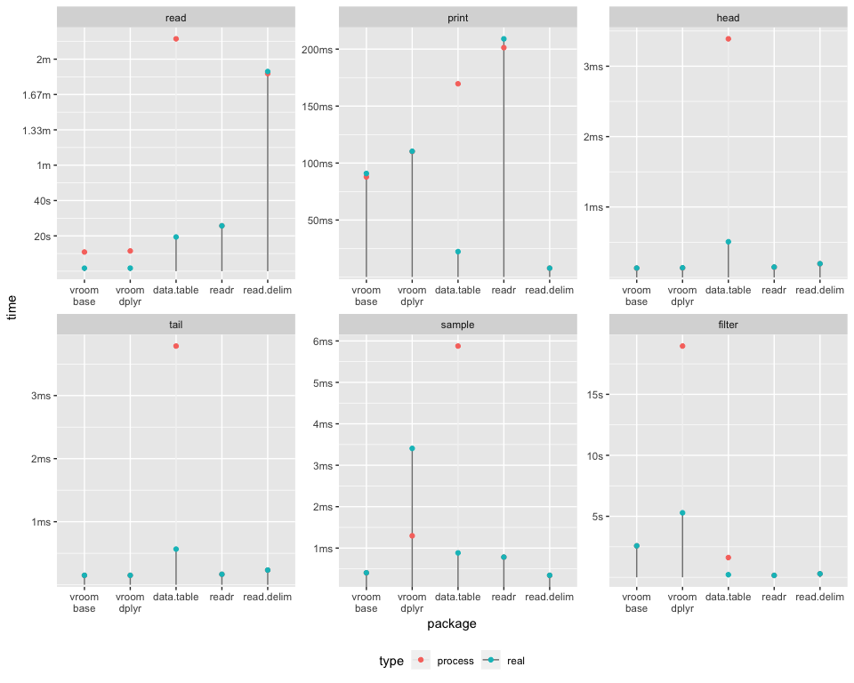

Benchmarks
================

vroom is an experiment for a future version of readr (2.0), or a
possible extension package.

It stems from the observation that IO is not the bottle neck in parsing
delimited datasets, rather (re)-allocating memory and parsing the values
into R data types (particularly for characters) takes the bulk of the
time.

It relies on the Altrep framework available in R 3.5 to provide lazy /
delayed parsing of values in delimited files.

## How it works

The initial reading of the file simply records the locations of each
individual record, the actual values are not read into R. Altrep vectors
are created for each column in the data which hold a pointer to the
index and the memory mapped file. When these vectors are indexed the
value is read from the memory mapping.

This means initial reading is extremely fast, in the example below it is
~ 1/4 the time of the multi-threaded `data.table::fread()`. Sampling
operations are likewise extremely fast, as only the data actually
included in the sample is read. This means things like the tibble print
method, calling `head()`, `tail()` `x[sample(), ]` etc. have very low
overhead.

Filtering also can be fast, only the columns included in the filter
itself have to be fully read across the entire dataset, only the
filtered rows need to be read from the remaining columns.

(*N.B. currently the dplyr implementation materializes the all numeric
vectors when using `filter()` or `sample_n()`, so these cases are not as
fast as they could otherwise be*).

This approach also allows you to work with data that is larger than
memory. As long as you are careful to avoid materializing the entire
dataset at once it can be efficiently queried and subset.

Once a particular vector is fully materialized the speed for all
subsequent operations should be identical to a normal R vector.

There is also lots of possible speed improvements available. The indexer
could be highly parallelized, as it does not rely on R data structures
at all. The index could also be stored on disk, which would make
re-reading the file at a later time basically instantaneous.
Materializing non-character vectors could also be parallelized.

## Dataset

The dataset used in these benchmarks is from FOIA/FOILed Taxi Trip Data
from the NYC Taxi and Limousine Commission 2013, originally posted at
<http://chriswhong.com/open-data/foil_nyc_taxi/>. It is also hosted on
[archive.org](https://archive.org/details/nycTaxiTripData2013).

The first table trip\_fare\_1.csv was converted to tsv and saved as
trip\_fare\_1.tsv, It is 1.55G in size.

    #> Observations: 14,776,615
    #> Variables: 11
    #> $ medallion       <chr> "89D227B655E5C82AECF13C3F540D4CF4", "0BD7C8F5B...
    #> $ hack_license    <chr> "BA96DE419E711691B9445D6A6307C170", "9FD8F69F0...
    #> $ vendor_id       <chr> "CMT", "CMT", "CMT", "CMT", "CMT", "CMT", "CMT...
    #> $ pickup_datetime <chr> "2013-01-01 15:11:48", "2013-01-06 00:18:35", ...
    #> $ payment_type    <chr> "CSH", "CSH", "CSH", "CSH", "CSH", "CSH", "CSH...
    #> $ fare_amount     <dbl> 6.5, 6.0, 5.5, 5.0, 9.5, 9.5, 6.0, 34.0, 5.5, ...
    #> $ surcharge       <dbl> 0.0, 0.5, 1.0, 0.5, 0.5, 0.0, 0.0, 0.0, 1.0, 0...
    #> $ mta_tax         <dbl> 0.5, 0.5, 0.5, 0.5, 0.5, 0.5, 0.5, 0.5, 0.5, 0...
    #> $ tip_amount      <int> 0, 0, 0, 0, 0, 0, 0, 0, 0, 0, 0, 0, 0, 0, 0, 0...
    #> $ tolls_amount    <dbl> 0.0, 0.0, 0.0, 0.0, 0.0, 0.0, 0.0, 4.8, 0.0, 0...
    #> $ total_amount    <dbl> 7.0, 7.0, 7.0, 6.0, 10.5, 10.0, 6.5, 39.3, 7.0...

## Benchmarks

The code used to run the benchmarks is in
[bench/benchmark.R](https://github.com/jimhester/vroom/blob/master/bench/benchmark.R).

The benchmark `base` uses `vroom` with base functions for subsetting.
`dplyr` uses `vroom` to read the file and dplyr functions to subset.
`data.table` uses `fread()` to read the file and `data.table` functions
to subset and `readr` uses `readr` to read the file and `dplyr` to
subset.

The following operations are performed.

  - The data is read
  - `print()` - *N.B. read.delim uses `print(head(x, 25))` because
    printing the whole dataset takes \> 10 minutes*
  - `head()`
  - `tail()`
  - Sampling 100 random rows
  - Filtering for “UNK” payment, this is 6434 rows (0.0435% of total).

<table>

<thead>

<tr>

<th style="text-align:right;">

package

</th>

<th style="text-align:right;">

Time to read file

</th>

<th style="text-align:right;">

Total time for all operations (sec)

</th>

</tr>

</thead>

<tbody>

<tr>

<td style="text-align:right;">

vroom\_base

</td>

<td style="text-align:right;">

2.6s

</td>

<td style="text-align:right;">

5.3s

</td>

</tr>

<tr>

<td style="text-align:right;">

vroom\_dplyr

</td>

<td style="text-align:right;">

2.6s

</td>

<td style="text-align:right;">

12.4s

</td>

</tr>

<tr>

<td style="text-align:right;">

data.table

</td>

<td style="text-align:right;">

19.7s

</td>

<td style="text-align:right;">

19.9s

</td>

</tr>

<tr>

<td style="text-align:right;">

readr

</td>

<td style="text-align:right;">

25.8s

</td>

<td style="text-align:right;">

26.2s

</td>

</tr>

<tr>

<td style="text-align:right;">

read.delim

</td>

<td style="text-align:right;">

1m 51.1s

</td>

<td style="text-align:right;">

1m 51.4s

</td>

</tr>

</tbody>

</table>

Graph of timings, note because `vroom` and `data.table` operations use
multiple cores the processor time is often much higher than the real
time.

``` r
library(ggplot2)
library(forcats)
tm_df %>%
  mutate(package = fct_inorder(sub("_", "\n", package))) %>%
  ggplot() +
  geom_segment(y = 0, aes(x = package, xend = package, yend = time, alpha = type), color = "grey50") +
    geom_point(aes(x = package, y = time, color = type)) +
    facet_wrap(vars(op), scales = "free") +
    bench::scale_y_bench_time(base = NULL) +
    theme(legend.position = "bottom")
```

<!-- -->

``` r
sessioninfo::package_info(c("vroom", "readr", "dplyr", "data.table"), dependencies = FALSE)
#>  package    * version    date       lib source        
#>  data.table   1.11.8     2018-09-30 [1] CRAN (R 3.5.0)
#>  dplyr      * 0.7.8      2018-11-10 [1] CRAN (R 3.5.0)
#>  readr        1.3.1      2018-12-21 [1] CRAN (R 3.5.0)
#>  vroom        0.0.0.9000 2018-12-28 [1] local         
#> 
#> [1] /Users/jhester/Library/R/3.5/library
#> [2] /Library/Frameworks/R.framework/Versions/3.5/Resources/library
```
